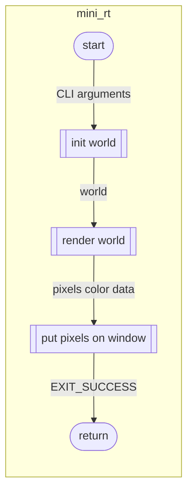
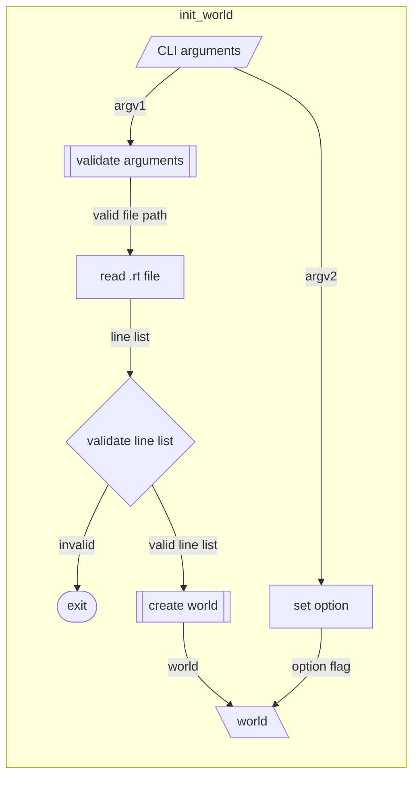
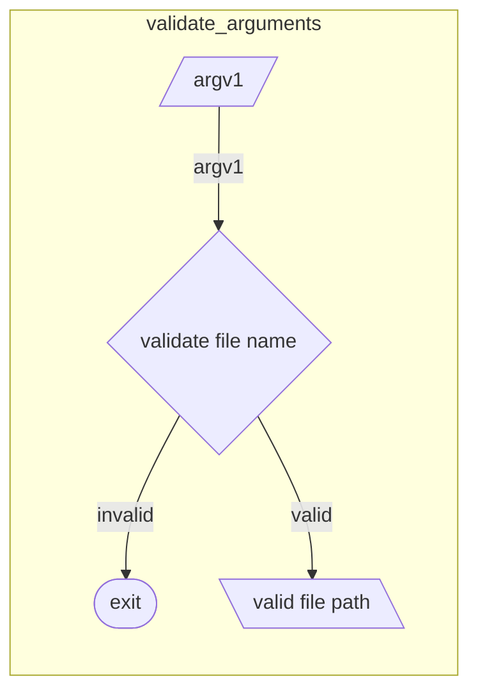
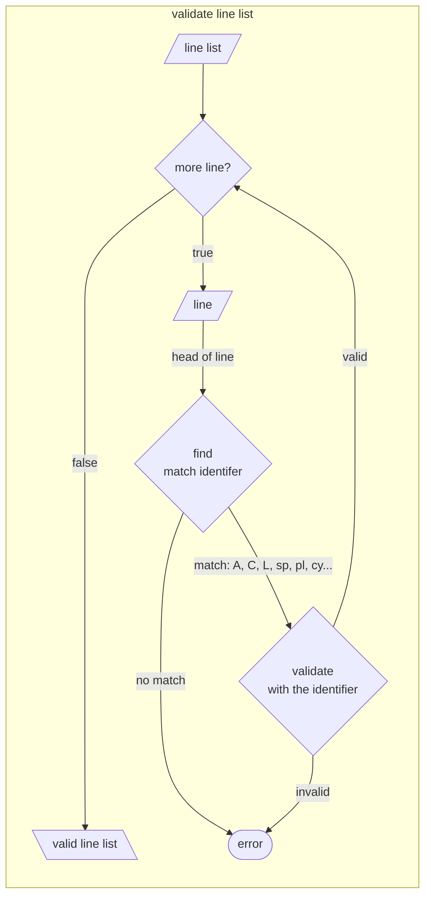
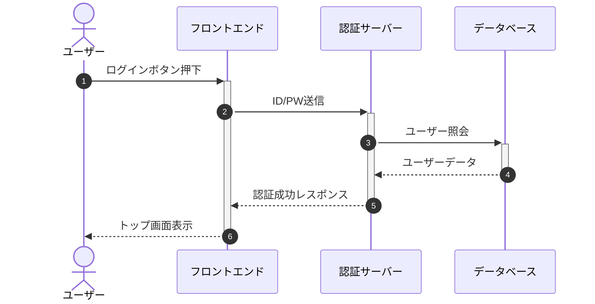
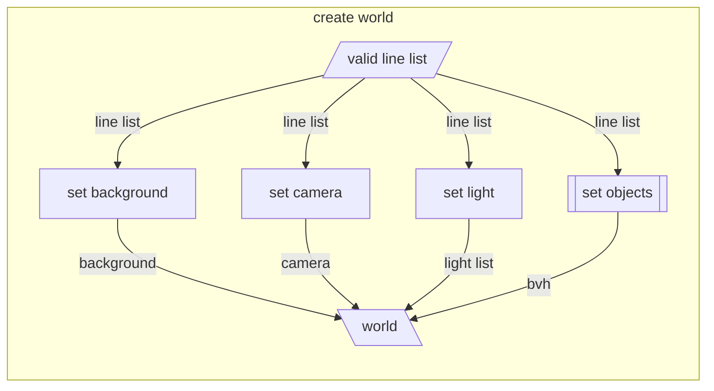
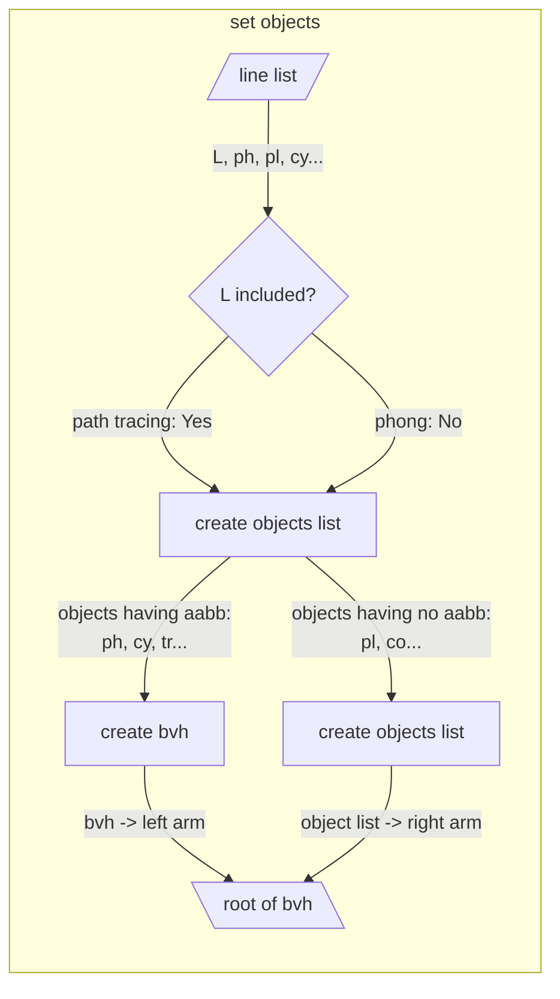
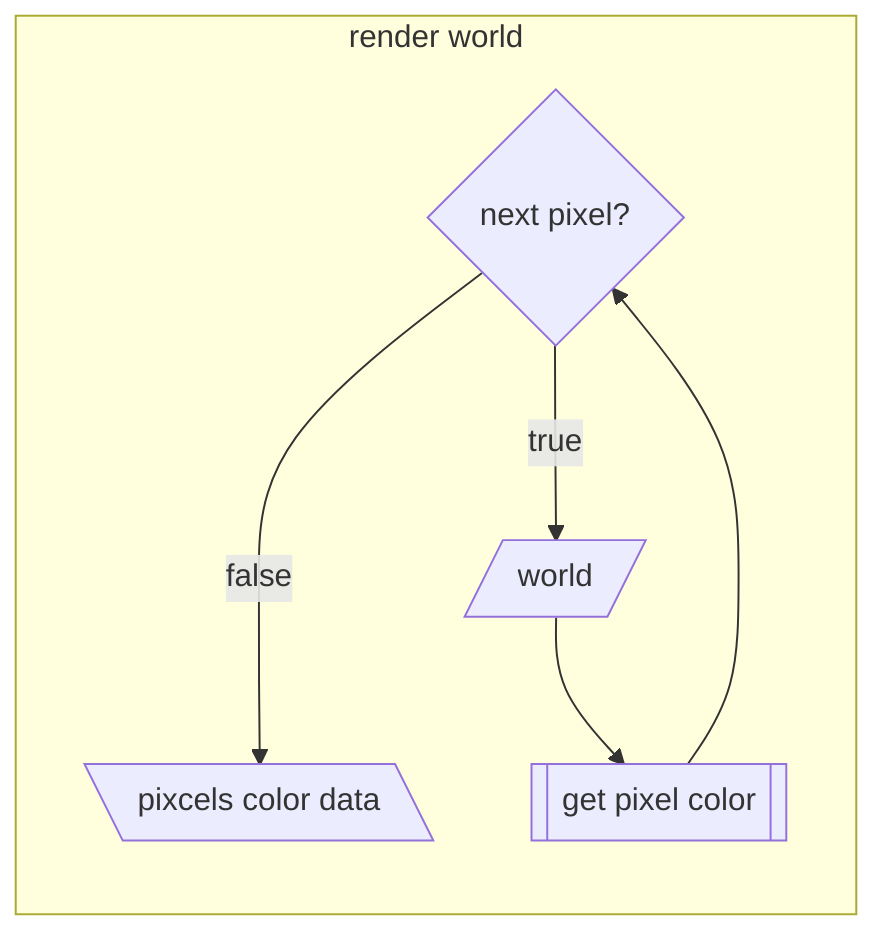
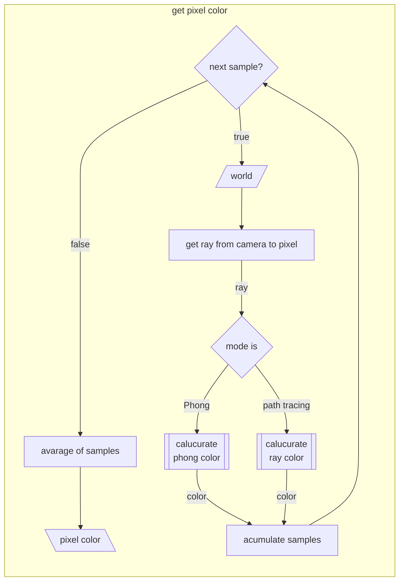
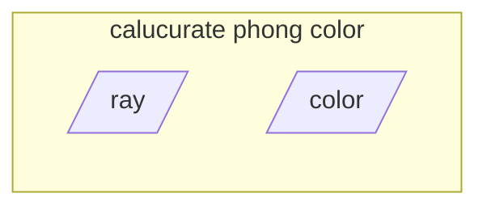

## next to do
- put pixels on window
- calucurate phong color
- calucurate ray color
- set_objects





```mermaid
flowchart
%% 	subgraph validate_line_list [validate line list]
%% 		direction TB
%% 		input[/line list/]-->|each line|validate_line
%% 		subgraph validate_line
%% 			direction TB
%% 			vlin[/line/]-->|head of line|if1{find
%% 			match identifer}
%% 			if1-->|no match|error
%% 			if1-->|match: A, C, L, sp, pl, cy...|if2{validate
%% 			with the identifier}
%% 			if2-->|valid|vlout[\valid line\]
%% 			if2-->|invalid|error
%%% 		error([error])
%% 		end
%% 		validate_line-->|each line|output[\valid line list\]
%% 	end
```




```mermaid
stateDiagram-v2

```










```mermaid
flowchart	
```