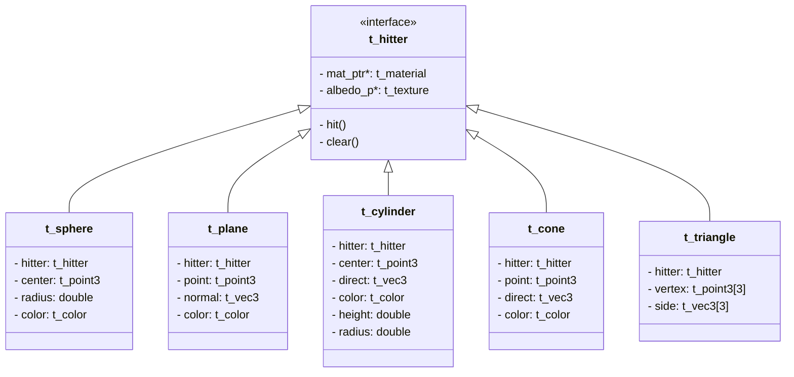
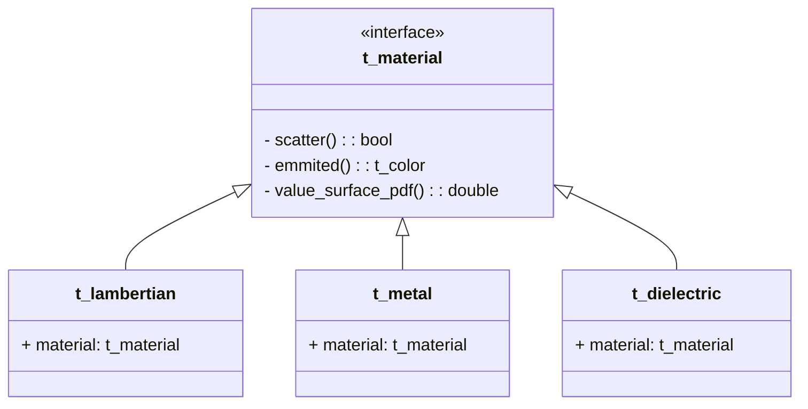
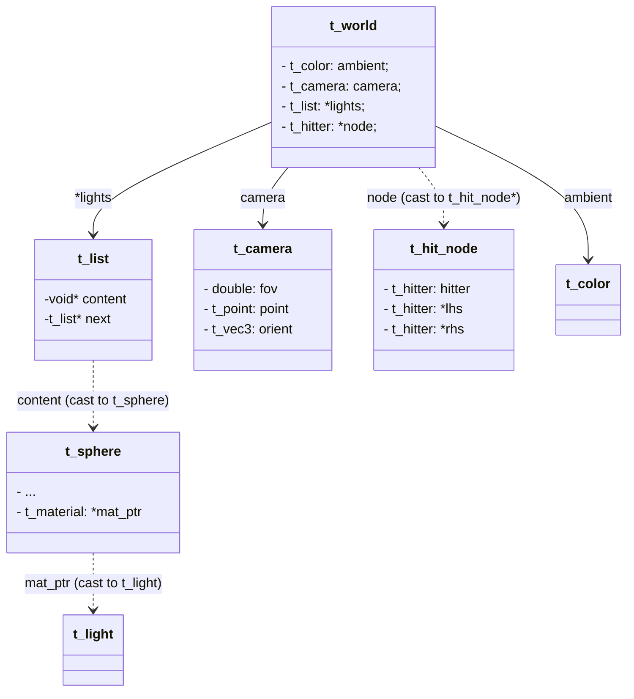
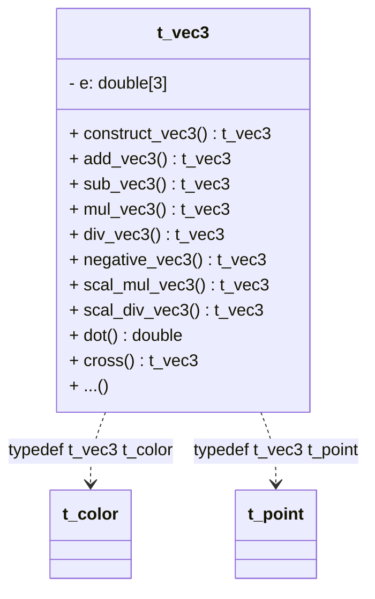

```mermaid
classDiagram
	class t_hitter {
		<<interface>>
		- mat_ptr*:		t_material
		- albedo_p*:	t_texture
		- hit()
		- clear()
	}
	class t_sphere {
		- hitter:	t_hitter
		- center:	t_point3
		- radius:	double
		- color:	t_color
	}
	class t_plane {
		- hitter:	t_hitter
		- point:	t_point3
		- normal:	t_vec3
		- color:	t_color
	}
	class t_cylinder {
		- hitter:	t_hitter
		- center:	t_point3
		- direct:	t_vec3
		- color:	t_color
		- height:	double
		- radius:	double
	}
	class t_cone {
		- hitter:	t_hitter
		- point:	t_point3
		- direct:	t_vec3
		- color:	t_color
	}
	class t_triangle {
		- hitter:	t_hitter
		- vertex:	t_point3[3]
		- side:		t_vec3[3]
	}

	t_hitter <|-- t_sphere
	t_hitter <|-- t_plane
	t_hitter <|-- t_cylinder
	t_hitter <|-- t_cone
	t_hitter <|-- t_triangle
```

```mermaid
classDiagram
	class t_material{
		<<interface>>
		- scatter():			bool
		- emmited():			t_color
		- value_surface_pdf():	double
	}
	class t_lambertian {
		+ material:		t_material
	}
	class t_metal {
		+ material:		t_material
	}
	class t_dielectric {
		+ material:		t_material
	}
	t_material <|-- t_lambertian
	t_material <|-- t_metal
	t_material <|-- t_dielectric
```

```mermaid
classDiagram
	class t_world {
		- t_color:		ambient;
		- t_camera:		camera;
		- t_list:		*lights;
		- t_hitter:		*node;
	}
	class t_list {
		-void* content
		-t_list* next
	}
	class t_camera {
		- double:	fov
		- t_point:	point
		- t_vec3:	orient
	}
	class t_hit_node {
		- t_hitter:	hitter
		- t_hitter:	*lhs
		- t_hitter:	*rhs
	}

	class t_sphere {
		- ...
		- t_material:	*mat_ptr
	}

	class t_light {
	}
	%% 関係の定義
	t_world --> t_list : *lights
	t_world --> t_color : ambient
	t_world --> t_camera : camera
	t_world ..> t_hit_node : node (cast to t_hit_node*)

	t_list ..> t_sphere : content (cast to t_sphere)
	t_sphere ..> t_light : mat_ptr (cast to t_light)
```

```mermaid
classDiagram
	class t_vec3 {
		- e: double[3]
		+ construct_vec3() t_vec3
		+ add_vec3() t_vec3
		+ sub_vec3() t_vec3
		+ mul_vec3() t_vec3
		+ div_vec3() t_vec3
		+ negative_vec3() t_vec3
		+ scal_mul_vec3() t_vec3
		+ scal_div_vec3() t_vec3
		+ dot() double
		+ cross() t_vec3
		+ ...()
	}
	class t_color {
	}

	t_vec3 ..> t_color : typedef t_vec3 t_color
	t_vec3 ..> t_point : typedef t_vec3 t_point
```