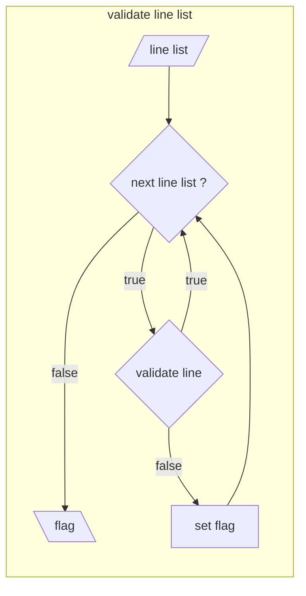
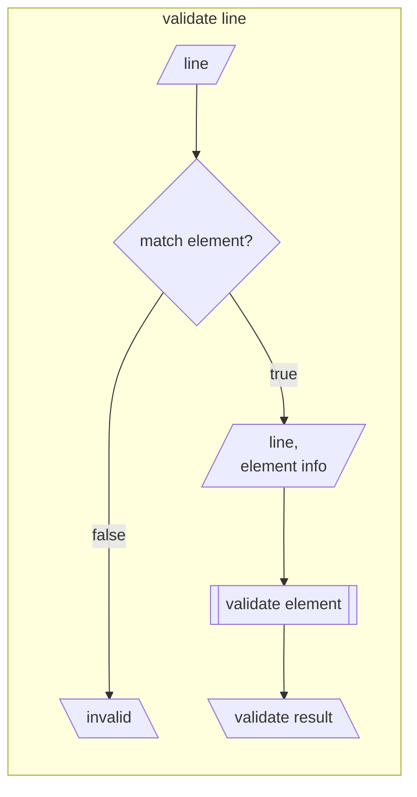

```mermaid
flowchart
	subgraph validate line list
	direction TB
	input1[/line list/]-->if1
	if1{next line list ?}-->|true|if2
	if1--->|false|output1[\flag\]
	if2{validate line}-->|true|if1
	if2-->|false|vll2
	vll2[set flag]-->if1
	end
```

```mermaid
flowchart
	subgraph validate line
	direction TB
	input1[/line/]-->if1
	if1{match element?}-->|true|input2
	if1---->|false|output2[\invalid\]
	input2[/line,
	element info/]-->vl1
	vl1[[validate element]]-->output
	output[\validate result\]
	end
```

```mermaid
flowchart
	subgraph validate element
	direction TB
	input1[/line, element_info/]-->if1
	if1{next
	skip func?}----->|false|output1
	if1-->|true|input2[/line/]
	input2-->ve1[skip func]
	ve1-->if2
	if2{is valid}-->|true|if1
	if2-->|false|output2
	output1[\valid\]
	output2[\invalid\]
	end
```