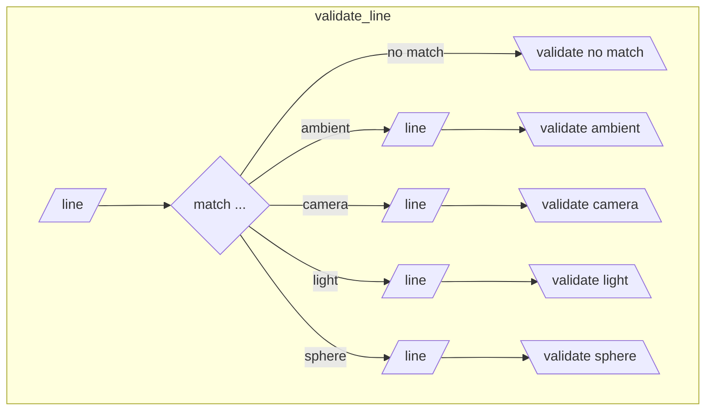
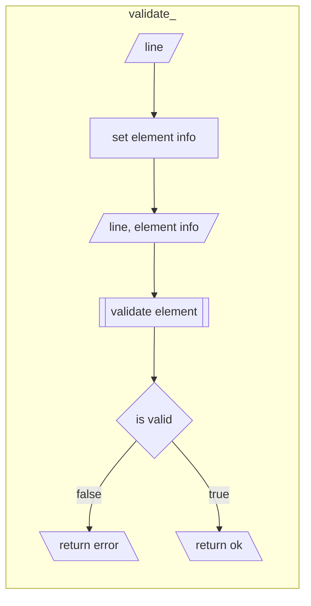
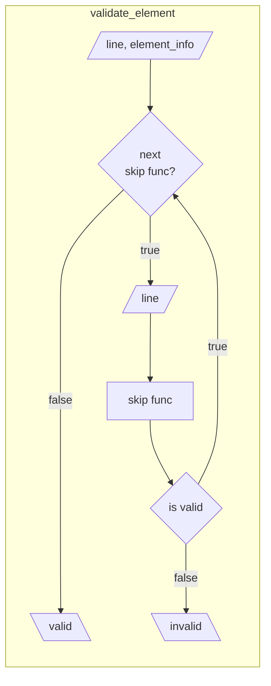

```mermaid
flowchart
	subgraph validate_line
	direction LR
	input1[/line/]-->if1
	if1{match ...}-->|ambient|input2
	if1-->|camera|input3
	if1-->|light|input4
	if1-->|sphere|input5
	if1--->|no match|output[\validate no match\]
	input2[/line/]-->vl2
	vl2[\validate ambient\]
	input3[/line/]-->vl3
	vl3[\validate camera\]
	input4[/line/]-->vl4
	vl4[\validate light\]
	input5[/line/]-->vl5
	vl5[\validate sphere\]
	end
```

```mermaid
flowchart
	subgraph validate_
	direction TB
	input1[/line/]-->v1
	v1[set element info]
	v1-->input2[/line, element info/]
	input2-->v2[[validate element]]
	v2-->if1{is valid}
	if1-->|false|output1[\return error\]
	if1-->|true|output2[\return ok\]
	end
```

```mermaid
flowchart
	subgraph validate_element
	direction TB
	input1[/line, element_info/]-->if1
	if1{next
	skip func?}----->|false|output1
	if1-->|true|input2[/line/]
	input2-->ve1[skip func]
	ve1-->if2
	if2{is valid}-->|true|if1
	if2-->|false|output2
	output1[\valid\]
	output2[\invalid\]
	end
```