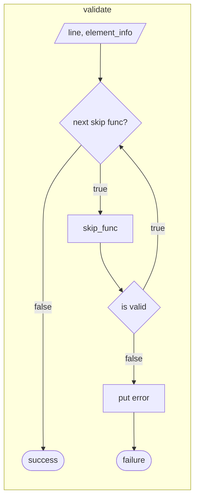
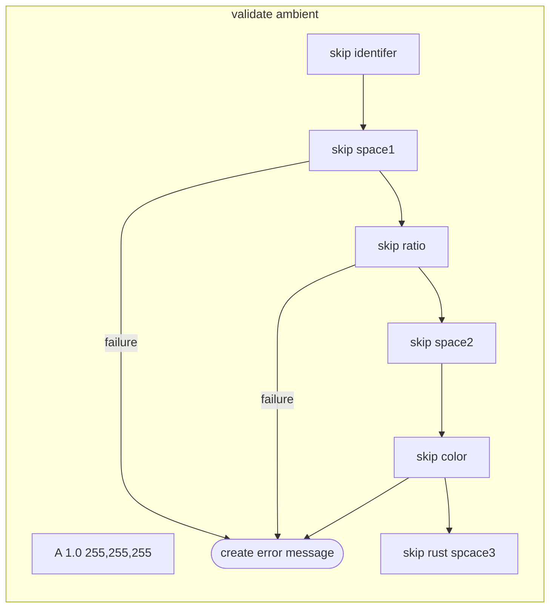

```mermaid
flowchart
subgraph validate
	direction TB
	input[/line, element_info/]
	wh----->|false|output([success])
	input-->wh{next skip func?}
	wh-->|true|v2[skip_func]
	v2-->if1{is valid}
	if1-->|true|wh
	if1-->|false|v3[put error]
	v3-->f([failure])
end
```
```mermaid
flowchart 
```

```mermaid
flowchart
	subgraph validate ambient
		direction TB
		ex[A 1.0 255,255,255]
		va0[skip identifer]
		va0-->va1[skip space1]
		va1-->|failure|err([create error message])
		va1-->va2[skip ratio]
		va2-->va3[skip space2]
		va2-->|failure|err
		va3-->va4[skip color]
		
		va4-->err
		va4-->va5[skip rust spcace3]
	end
```
